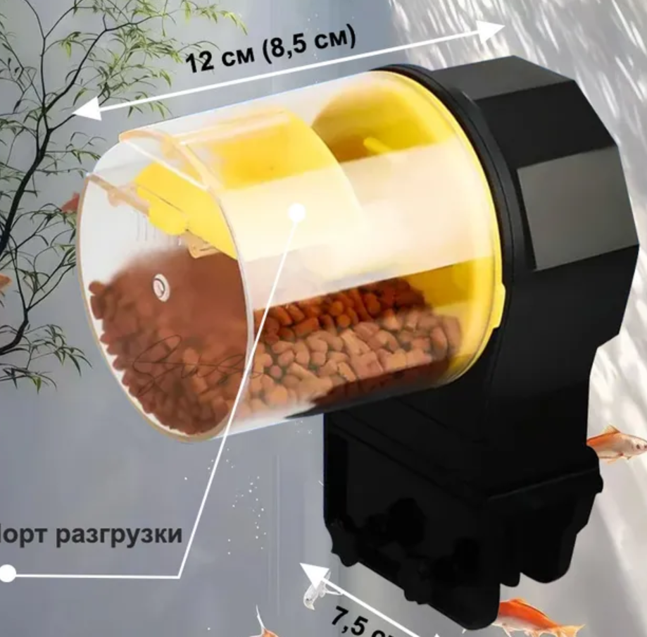
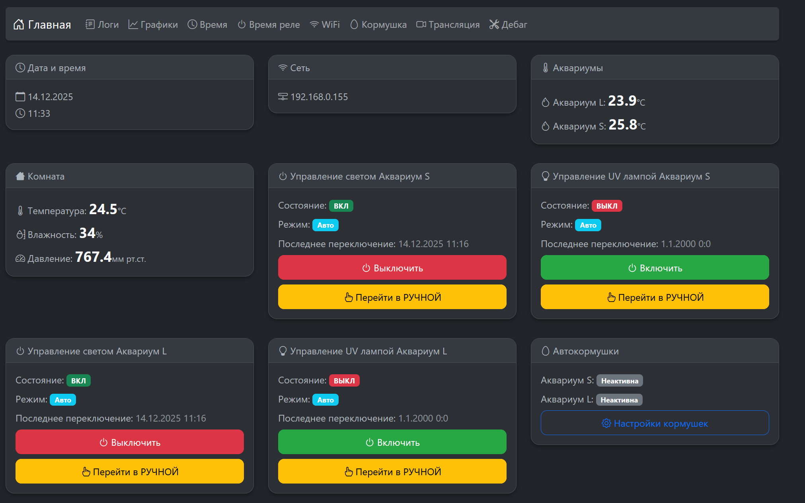
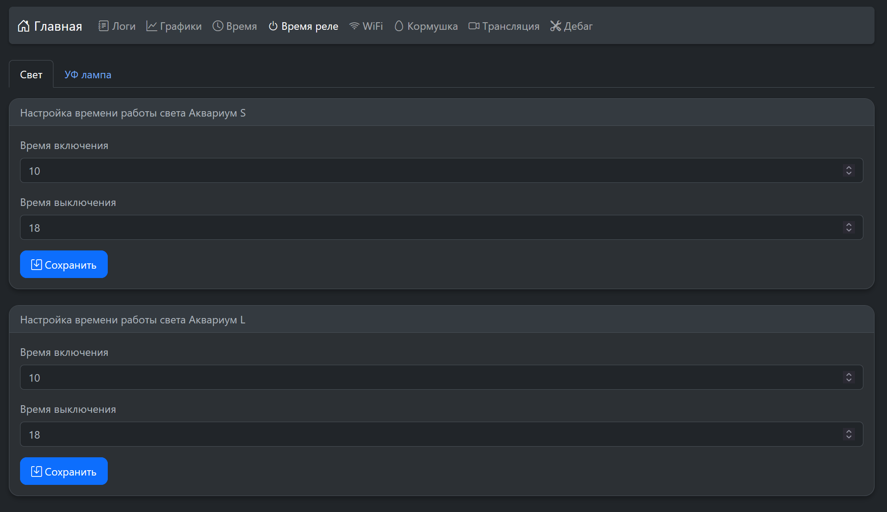
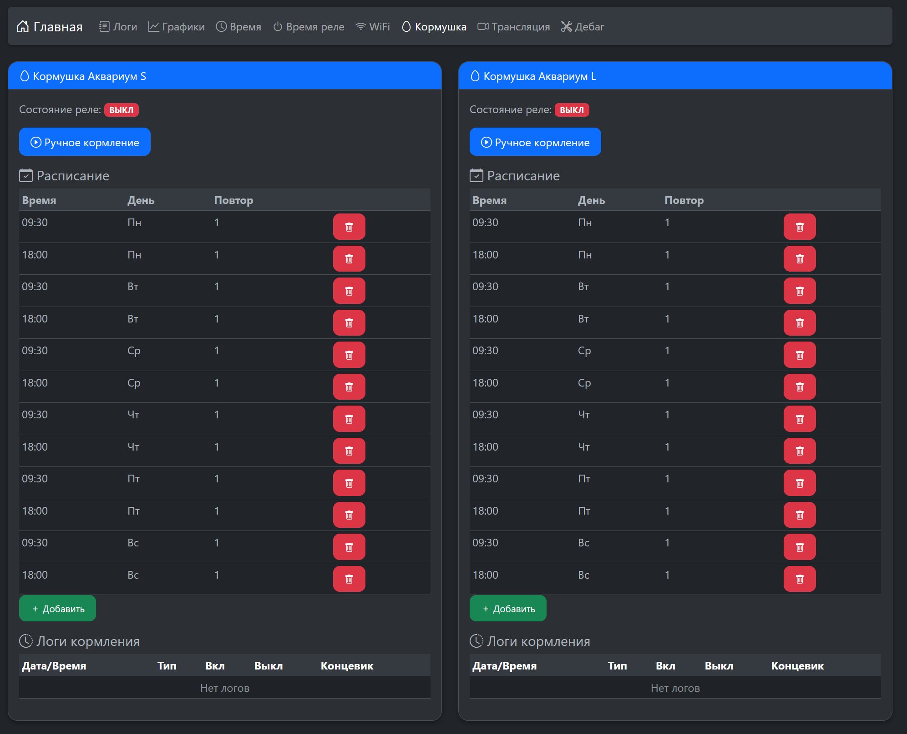
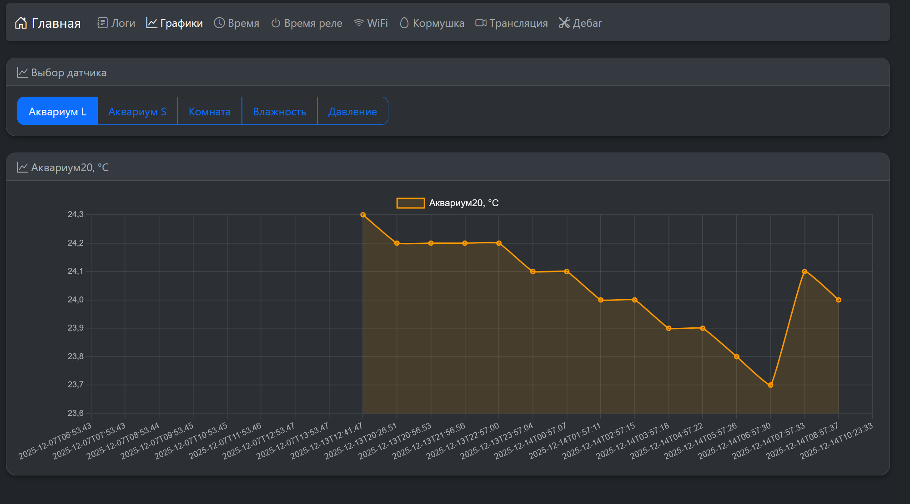

# AquaV1 - Система мониторинга аквариума

## Описание
Система мониторинга и управления аквариумом на базе ESP32. Проект включает в себя:
- Мониторинг температуры воды (внутренний и внешний датчики)
- Мониторинг параметров помещения (температура, влажность, давление)
- Управление реле через веб-интерфейс и локальное управление
- Логирование данных
- LCD дисплей для отображения информации
- Веб-сервер для удаленного управления

## Аппаратная часть
- M5 Stack Atom Lite (ESP32)
  - 240MHz dual core
  - 520KB SRAM
  - 4MB Flash
  - Встроенный RGB LED (SK6812)
  - Встроенная кнопка (GPIO 39)
- LCD дисплей I2C (20x4)
- Датчики температуры DS18B20 (2 шт)
- Датчик температуры/влажности/давления BME280
- RTC модуль DS1307
- Энкодер для управления меню
- Реле SRD-05VDC-SL-C для управления светом аквариумов и UV лампами
- PCF8574 расширитель портов I2C (для UV ламп и автокормушек)
- MOSFET IRLB8721 для управления щеточными моторами автокормушек
- Диод 1N5819 для защиты от обратной ЭДС мотора (обязателен!)

## Подключение
- RELAY_PIN_TANK20: GPIO 33 (реле SRD-05VDC-SL-C для света аквариума 20л)
- RELAY_PIN_TANK10: GPIO 23 (реле SRD-05VDC-SL-C для света аквариума 10л)
- ONE_WIRE_BUS: GPIO 19 (для датчиков DS18B20)
- I2C_SDA: GPIO 21 (LCD, BME280, RTC, PCF8574)
- I2C_SCL: GPIO 22 (LCD, BME280, RTC, PCF8574)
- GPIO 25: резервный пин (ранее использовался для UV лампы)
- PCF8574 (I2C адрес 0x20):
  - Пин 0: UV лампа Tank10 (выход) → Реле SRD-05VDC-SL-C
  - Пин 1: UV лампа Tank20 (выход) → Реле SRD-05VDC-SL-C
  - Пин 2: Концевик автокормушки10 (вход)
  - Пин 3: MOSFET IRLB8721 автокормушки10 (выход) → через резистор 220 Ом на Gate
  - Пин 4: Концевик автокормушки20 (вход)
  - Пин 5: MOSFET IRLB8721 автокормушки20 (выход) → через резистор 220 Ом на Gate

**Важно:**
- Свет аквариумов и UV лампы управляются через реле SRD-05VDC-SL-C
- Моторы автокормушек управляются через MOSFET IRLB8721 с резистором 220 Ом на сигнальном входе (Gate)
- На каждый мотор обязательно установить диод 1N5819 для защиты от обратной ЭДС (анод к минусу мотора/Drain MOSFET, катод к +3.3V питания мотора)
- **MOSFET подключается к минусу мотора (low-side switching)** - управление осуществляется через разрыв минусового провода

## Питание системы

**Вся схема управления аквариумом работает от 5В.**

Кормушки подключены через линейный стабилизатор напряжения **AMS1117** на 3.3В:
- Вход AMS1117: +5V
- Выход AMS1117: +3.3V (питание мотора кормушки)
- Общий GND

## Модификация автокормушки

В проекте используется типовая автокормушка из маркета (например, как на фото ниже), которая изначально питается от 2 пальчиковых батареек и имеет встроенный концевик.



**Процесс модификации:**

1. Разобрать кормушку и извлечь плату управления
2. Подключить провода напрямую к мотору:
   - Плюс мотора → к +3.3V (через AMS1117)
   - Минус мотора → к MOSFET IRLB8721 (Drain), MOSFET Source → к GND
   - **Важно:** MOSFET подключается к минусу мотора (low-side switching)
3. Концевик уже встроен в кормушку, подключить его к PCF8574 (пин 2 для Tank10, пин 4 для Tank20)
4. Управление мотором осуществляется через MOSFET IRLB8721, подключенный к PCF8574

**Характеристики кормушки:**
- Размеры: 12 см (8.5 см по корпусу), высота 7.5 см
- Порт разгрузки корма расположен в нижней части

## Управление кнопкой Atom

Встроенная кнопка M5 Stack Atom Lite (GPIO 39) позволяет управлять светом аквариумов:

- **Одиночный клик**: Переключает состояние обоих светов одновременно (вкл/выкл). Переводит оба света в ручной режим управления.
- **Двойной клик**: Возвращает оба света в автоматический режим управления (сброс ручного режима).

### Индикация LED

Встроенный RGB LED (SK6812) отображает текущее состояние светов:

- **Синий**: Оба света работают в автоматическом режиме
- **Желтый**: Один из светов находится в ручном режиме
- **Зеленый**: Оба света включены в ручном режиме
- **Красный**: Оба света выключены в ручном режиме

## Схемы подключения

### Реле SRD-05VDC-SL-C для света аквариума

```
ESP32 GPIO 33/23 ──┐
                   │
ESP32 GND ─────────┼─── Реле GND
                   │
ESP32 5V ─────────┼─── Реле VCC
                   │
                   └─── Реле IN (сигнал управления)
                        │
                        └─── Реле COM ─── Лампа ─── 220V
                             │
                             └─── Реле NO ─── 220V
```

### Реле SRD-05VDC-SL-C для UV лампы (через PCF8574)

```
ESP32 I2C (SDA/SCL) ── PCF8574 (0x20)
                            │
                            ├── Пин 0/1 ── Реле IN
                            │                │
                            │                └── Реле COM ─── UV лампа ─── 220V
                            │                │
                            │                └── Реле NO ─── 220V
                            │
                            └── PCF8574 VCC ─── 5V
                            └── PCF8574 GND ─── GND
```

### MOSFET IRLB8721 для мотора автокормушки

```
+5V ── AMS1117 ── +3.3V ──┬── Мотор (+)
                          │
                          └── Диод 1N5819 (катод) ── Диод анод ── Мотор (-) ── MOSFET Drain ── MOSFET Source ── GND

PCF8574 Пин 3/5 ── Резистор 220 Ом ── MOSFET Gate (IRLB8721)
```

**Примечания:**
- Резистор 220 Ом обязателен для ограничения тока на Gate MOSFET
- AMS1117 понижает напряжение с 5В до 3.3В для питания мотора кормушки
- **MOSFET подключается к минусу мотора (low-side switching)** - управление через разрыв минусового провода
- Диод 1N5819 подключен параллельно мотору (анод к минусу мотора/Drain, катод к +3.3V) для защиты от обратной ЭДС
- Без диода возможен выход из строя MOSFET и других компонентов

## Функциональность
1. **Мониторинг температуры**
   - Датчик в аквариуме 20л (DS18B20)
   - Датчик в аквариуме 10л (DS18B20)
   - Температура помещения (BME280)

2. **Управление реле**
   - Автоматическое управление по времени (8:00-19:00)
   - Ручное управление через меню
   - Удаленное управление через веб-интерфейс
   - Сброс ручного управления в полночь
   - Отдельное управление для Tank10 и Tank20

3. **Управление UV лампами**
   - Две отдельные UV лампы (Tank10 и Tank20)
   - Управление через PCF8574 расширитель портов
   - Автоматическое управление по времени
   - Ручное управление через веб-интерфейс
   - Отдельные настройки времени для каждой лампы

4. **Мониторинг помещения**
   - Температура (BME280)
   - Влажность (BME280)
   - Давление (BME280)

5. **Логирование данных**
   - Агрегация данных: 30 секунд → 10 минут → 1 час
   - Хранение последних 24 часов в EEPROM
   - Хранение до 72 часов (3 суток) в SPIFFS
   - Отображение логов в текстовом и графическом виде
   - Параметры: температура аквариумов, температура помещения, влажность, давление
   - Критические события (изменения параметров >10%) сохраняются отдельно

6. **Веб-интерфейс**
   - Отображение текущих параметров
   - Управление реле и UV лампами
   - Просмотр логов и графиков
   - Настройка времени работы реле и UV ламп
   - Управление автокормушками и настройка расписания кормления









7. **Автокормушки**
   - Две отдельные автокормушки (Tank10 и Tank20)
   - Управление через PCF8574 и MOSFET IRLB8721
   - Настраиваемое расписание кормления по дням недели
   - Ручное кормление через веб-интерфейс
   - Логирование всех кормлений с указанием типа (авто/ручное)
   - Концевик для автоматической остановки мотора

8. **Локальное управление**
   - Меню на LCD дисплее (20x4)
   - Управление энкодером и кнопкой
   - Настройка времени (RTC)

## Зависимости
- Arduino.h
- Wire.h
- LiquidCrystal_I2C
- OneWire
- DallasTemperature
- ESP32Encoder
- WiFi.h
- RTClib
- Adafruit_BME280
- WebServer.h

## Структура проекта
```
├── include/
│   ├── config.h        - Конфигурация пинов и параметров
│   ├── controls.h      - Управление энкодером и кнопкой
│   ├── display.h       - Работа с LCD дисплеем
│   ├── logger.h        - Логирование данных
│   ├── net.h           - Сетевая функциональность
│   ├── web_server.h    - Веб-сервер
│   └── secrets.h       - Конфиденциальные данные
├── src/
│   ├── main.cpp        - Основной код
│   ├── controls.cpp    - Реализация управления
│   ├── display.cpp     - Реализация дисплея
│   ├── logger.cpp      - Реализация логирования
│   ├── net.cpp         - Реализация сети
│   └── web_server.cpp  - Реализация веб-сервера
├── lib/                - Внешние библиотеки
├── docs/
│   └── images/         - Изображения для документации
└── platformio.ini      - Конфигурация PlatformIO
```

## Настройка
1. Скопируйте `secrets.h.example` в `secrets.h`
2. Настройте параметры WiFi в `secrets.h`:
   - WIFI_SSID - имя вашей WiFi сети
   - WIFI_PASSWORD - пароль от WiFi сети
3. Соберите схему согласно подключению
4. Загрузите прошивку на M5 Stack Atom Lite через PlatformIO

## Использование
1. Включите устройство
2. Подключитесь к WiFi сети
3. Откройте веб-интерфейс по IP адресу устройства
4. Используйте энкодер и кнопку для навигации по меню
5. Управляйте реле через веб-интерфейс или локальное меню
6. Настройте время работы реле (по умолчанию 8:00-19:00)

## Лицензия
MIT License